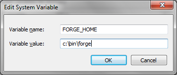
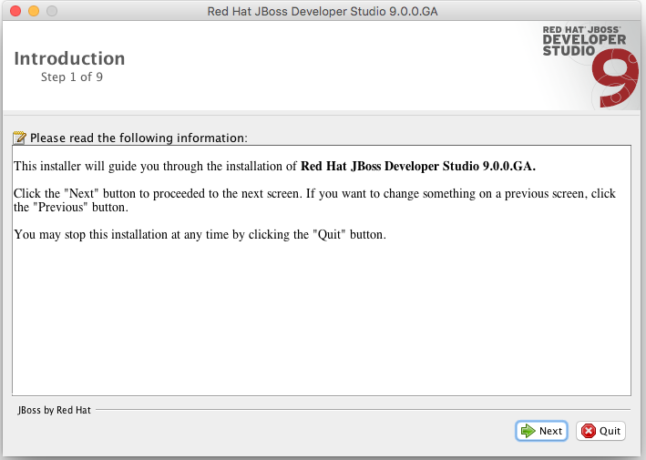
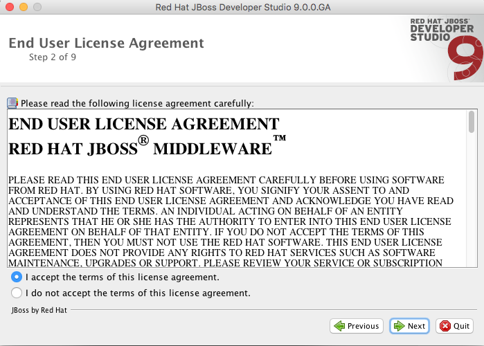
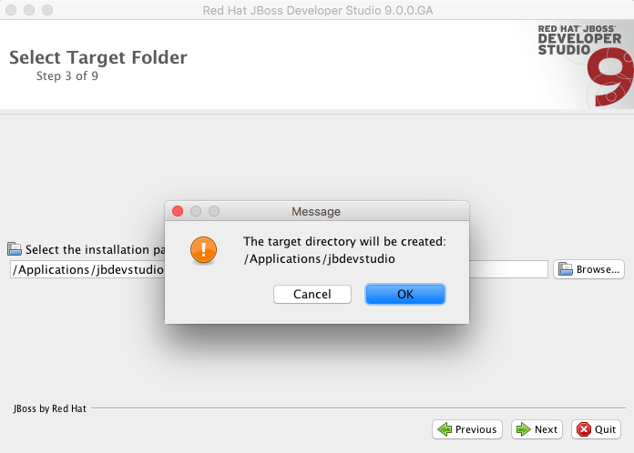
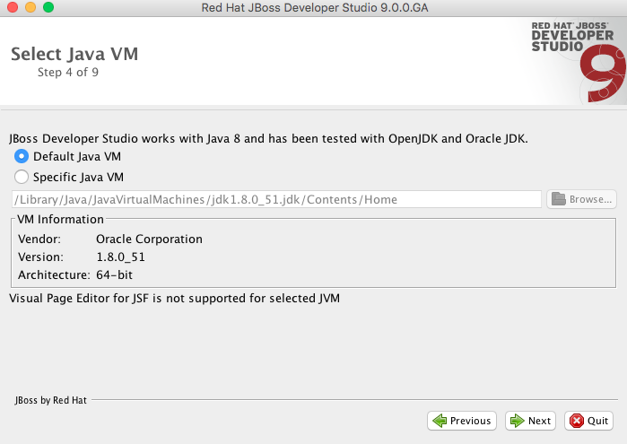
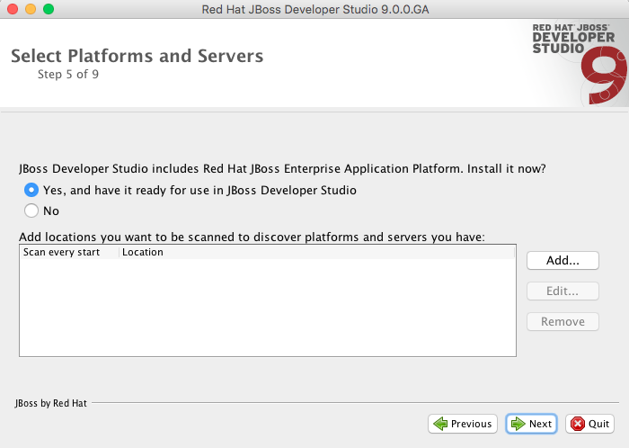
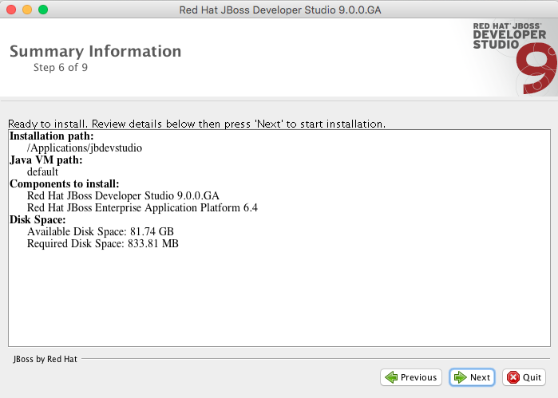
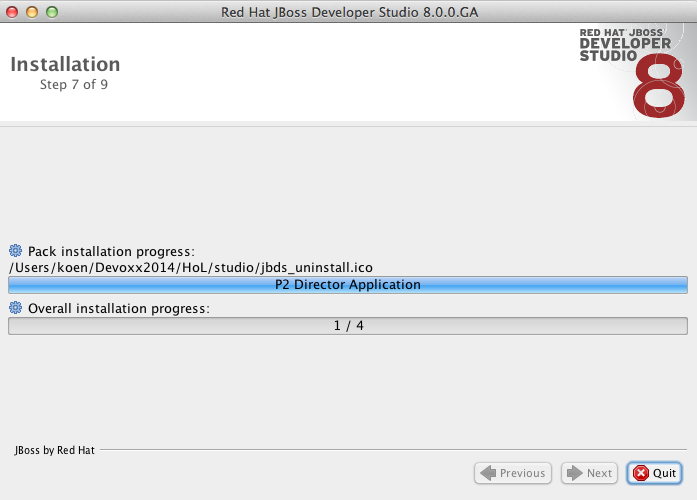
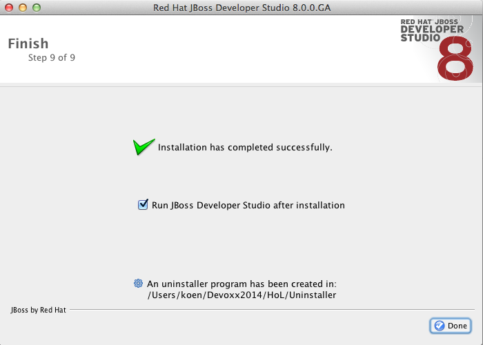
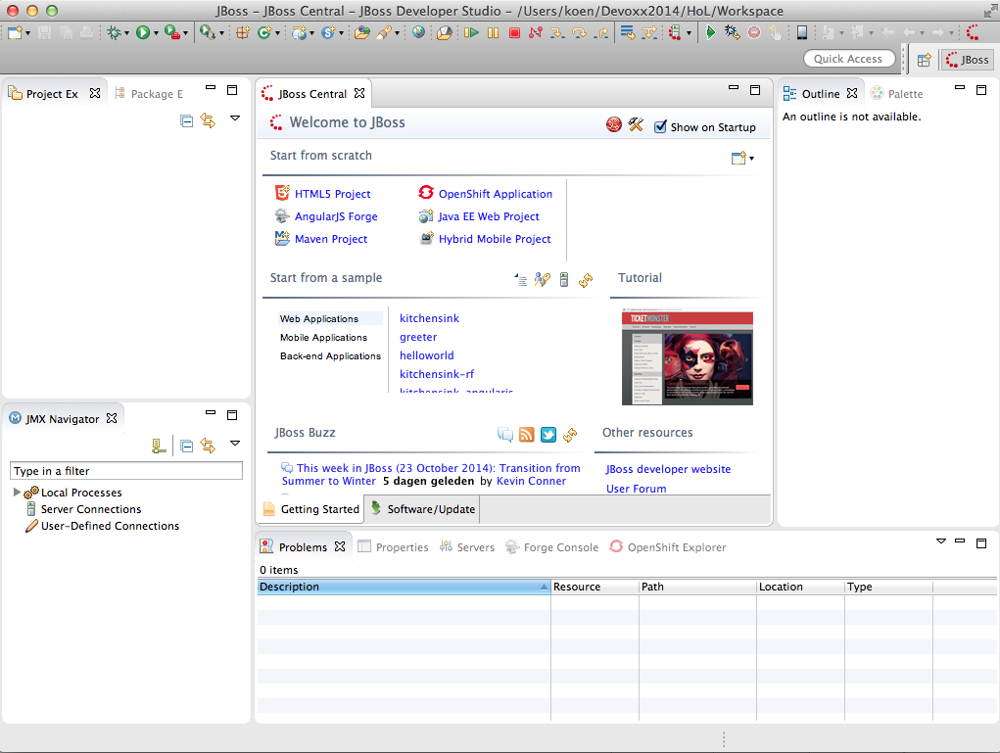

== Installing Forge
[[installing-forge]]

Installing Forge is a relatively short process, and this section will take you through the fundamentals (providing links to external materials if required); however, if you encounter any issues with this process, please ask in the team.

If you are a command line addict or are more confortable with a Eclipse, you can choose to install JBoss Forge CLI or JBDS.

=== Installing Forge CLI

Follow these steps to install a Forge distribution:

- Ensure that you have already installed a http://www.oracle.com/technetwork/java/javase/downloads/index.html[Java 8+ JDK].
- http://red.ht/1vEB0v0[Download] and Un-zip Forge into a folder on your hard-disk, this folder will be your `FORGE_HOME`
- Add `$FORGE_HOME/bin` to your path (windows, linux, mac osx)
- Run JBoss Forge by typing the `forge` command in your system terminal.

==== Windows 

Extract the distribution archive, to the directory you wish to install Forge. + 
Add the `FORGE_HOME` environment variable.

In the same dialog, add `%FORGE_HOME%\bin` to the system path.

image::../images/installing/windows/forge-cli-install2.png[title="Installing Forge CLI Step 2"]

Now open a system `cmd` or `command` prompt and run JBoss Forge by typing the `forge` command.

TIP: If you have installed Forge 1.x before, make sure to remove all the files from the `~/.forge` directory

==== Mac OS X or Linux

The easiest way to install Forge is to extract the distribution archive, to the directory you wish to install Forge. In a command terminal, add the `FORGE_HOME` environment variable, e.g: 

[source, console]
--
export FORGE_HOME=/usr/local/jboss/forge-distribution-2.12.1.Final
--
Add FORGE_HOME/bin environment variable to your path, e.g: 
[source, console]
--
export PATH=$FORGE_HOME/bin:$PATH
--
You can also install Forge via cURL

[source, console]
--
curl http://forge.jboss.org/sh | sh
-- 
or use Homebrew to install Forge natively, via:
[source, console]
--
brew install jboss-forge
--

Run JBoss Forge by typing the `forge` command in your system terminal.

=== Installing JBDS 9.0 with EAP

Installing JBDS is a piece of cake. Just download the installer from the 
http://www.jboss.org/products/devstudio/download/[JBoss website] 
and in the target folder you enter:

[source, console]
--
java -jar jboss-devstudio-<version>-installer-eap.jar
--

This will launch the installation process for your platform (Windows, Linux and OSX 
are supported). The wizard will take you through a number of consecutive steps that are
illustrated using screenshots below.

Congratulations! Now you are all set! Pressing `Done` will automatically launch JBDS.

image::../images/installing/workspace.png[title="Choose Workspace"]

Choose an appropriate workspace and press `OK` to see JBDS in all its glory.

